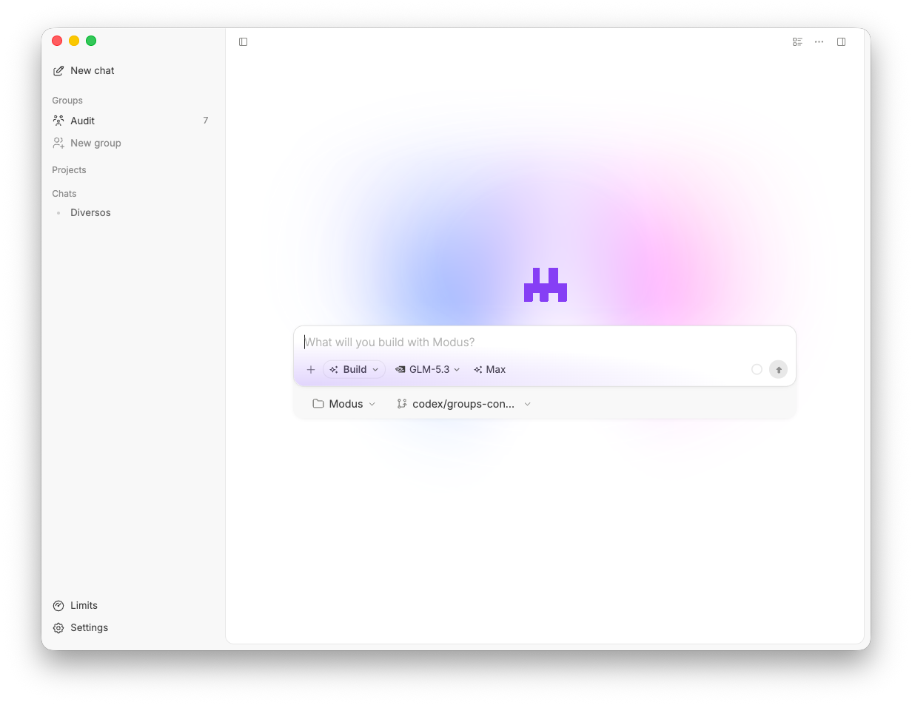

<p align="center">
  English | <a href="./README.zh-CN.md">简体中文</a>
</p>

<p align="center">
  
</p>

<p align="center">
  Local-first desktop workspace for AI coding agents.
</p>

<p align="center">
  <a href="#download">Download</a> ·
  <a href="#features">Features</a> ·
  <a href="#getting-started">Build from source</a> ·
  <a href="./docs/architecture/desktop-security.md">Security</a>
</p>



## About

Modus is an open-source desktop app for running AI coding agents inside real local projects.

Open a workspace, connect your own model provider, plan or build, inspect changes, approve risky actions, and keep the full workflow in one window.

## Download

The latest published release is [v0.1.1](https://github.com/Stoltembergg/modus/releases/tag/v0.1.1). Download the installer for your platform:

- **Windows:** [x64 installer](https://github.com/Stoltembergg/modus/releases/download/v0.1.1/Modus-0.1.1-win-x64-setup.exe)
- **macOS:** [Apple Silicon (ARM64)](https://github.com/Stoltembergg/modus/releases/download/v0.1.1/Modus-0.1.1-mac-arm64.dmg) · [Intel (x64)](https://github.com/Stoltembergg/modus/releases/download/v0.1.1/Modus-0.1.1-mac-x64.dmg)
- **Linux:** [AppImage (x86_64)](https://github.com/Stoltembergg/modus/releases/download/v0.1.1/Modus-0.1.1-linux-x86_64.AppImage) · [.deb (amd64)](https://github.com/Stoltembergg/modus/releases/download/v0.1.1/Modus-0.1.1-linux-amd64.deb)

The current installers are unsigned. Windows SmartScreen may warn on first install; macOS Gatekeeper may require right-clicking the app and choosing **Open**. See the [release notes](https://github.com/Stoltembergg/modus/releases/tag/v0.1.1) for details.

## Features

- **Workspaces and sessions** - Open local projects, switch recent workspaces, pin projects, and keep separate agent sessions per repo.
- **Bring your own models** - Configure built-in or custom PI-compatible providers, defaults, reasoning effort, thinking variants, and model limits.
- **Git workflow** - Review working tree changes, file diffs, branches, commit history, commits, pushes, and session change stats.
- **Terminal, browser, and files** - Use a real PTY terminal, an in-app browser with tabs and DevTools, and a workspace file explorer.
- **Fast Codebase** - Let the agent build a compact local code map before reading files, reducing broad grep/read exploration.
- **Subagents** - Create specialized subagents, track their activity, and apply or clean up their worktrees.
- **Agent Groups** - Create multi-agent rooms, with Coordinator enabled by default for new groups. A chronological timeline gives each user and agent message its own card, keeps internal coordination out of the conversation, and shows compact progress with retry/resume actions for interrupted or failed work.
- **Plan and build modes** - Start with a reviewable plan, answer structured questions, then move into implementation.
- **Context and images** - Attach files, folders, docs, Git diffs, terminal output, browser state, selected page elements, rules, and images.
- **MCP, skills, and rules** - Load Modus MCP servers, invoke local skills with `/`, and apply project rules from AGENTS/Claude/Cursor-style files.
- **Permissioned execution** - Route shell, Git, browser, MCP, file, and external actions through one approval flow.
- **Checkpoints and rollback** - Snapshot the workspace before agent runs and restore from the timeline when needed.

## Repo layout

```text
apps/desktop/     Electron product (main / preload / renderer)
crates/pty-host/  Rust PTY sidecar (modus-pty-host)
catalog/          Generated model provider catalog
docs/             Architecture notes and media
scripts/          Model catalog generator
```

The desktop app is self-contained under `apps/desktop`. Shared types and tools live in `apps/desktop/src/shared`, not in separate workspace packages.

## Getting Started

Requirements:

- Node.js `>= 22.22.3`
- npm
- Rust + Cargo (recent stable; crate uses edition 2024)
- Git

```bash
git clone https://github.com/Stoltembergg/modus.git
cd modus
npm install
npm run dev
```

Then open a workspace folder and configure a model provider in Settings.

## Development

```bash
npm run dev
npm run check
npm run test
npm --workspace @modus/desktop run typecheck
npm --workspace @modus/desktop run build:pty
npm --workspace @modus/desktop run build
```

### Build locally

```bash
npm run check
npm run test
npm --workspace @modus/desktop run package:win -- --publish never
npm --workspace @modus/desktop run package:mac -- --publish never
npm --workspace @modus/desktop run package:linux -- --publish never
```

Run the platform-matching package command on that OS. Packaged releases are also available in the [GitHub Releases page](https://github.com/Stoltembergg/modus/releases).

Releases are built by CI from `v*` tags; see [docs/releasing.md](docs/releasing.md).

## MCP Config

Modus only auto-loads its own MCP config files:

```text
~/.modus/mcp.json
<workspace>/.modus/mcp.json
```

It does not silently import Cursor, Claude, Warp, or other agent configs.

## Tech Stack

Electron, React, TypeScript, Tailwind CSS, Base UI, Motion, Monaco, xterm.js, Streamdown, Node SQLite, Rust `portable-pty`, `@earendil-works/pi-coding-agent`, and the MCP SDK.

## Contributing

Contributions are welcome. Before opening a pull request:

1. Read [CONTRIBUTING.md](./CONTRIBUTING.md) for the setup, checks, and PR expectations.
2. For a bug, use the bug report template. For an idea, use the feature request template. Please search existing reports first.
3. Keep pull requests focused and small, use Conventional Commits, and run `npm run check` and `npm run test`.

Questions and project discussion: use the repository's issue tracker once it is enabled. Security issues should follow [SECURITY.md](./SECURITY.md).

## License

Apache-2.0. See [LICENSE](./LICENSE).
