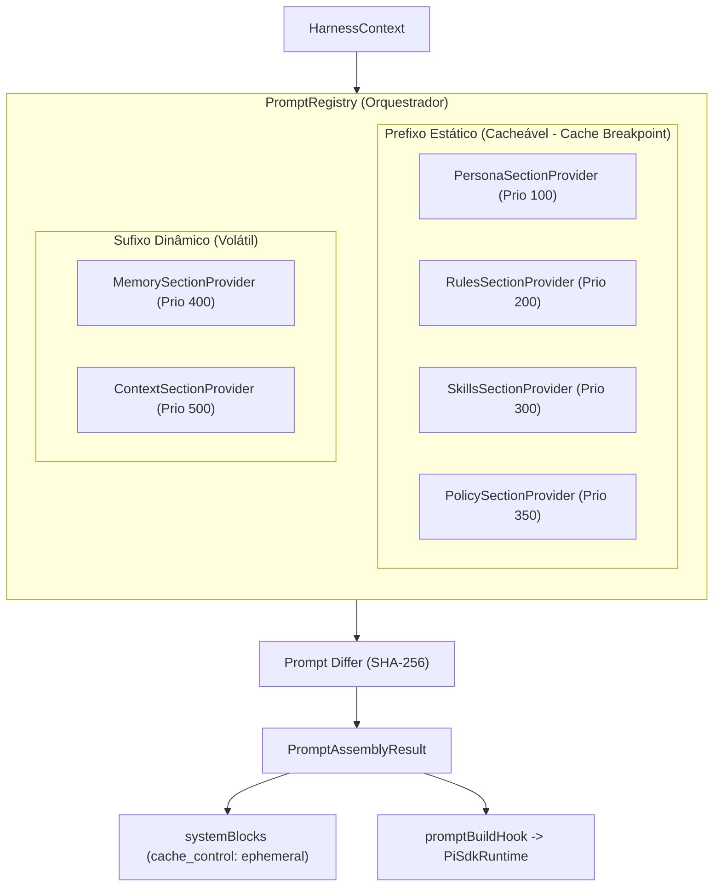

# Avaliação Técnica: Fase 2 & Fase 2.1 (PromptRegistry & Polish Sprint)

**Data:** 2026-10-06  
**Status:** CONCLUÍDO (100% dos testes e typecheck aprovados)  
**Escopo:** Modular Prompt System, Anthropic Prompt Caching Optimization, Fail-Open Resilience, Dual-Path Runtime Execution.

---

## 1. Sumário Executivo

A **Fase 2** e a **Fase 2.1 (Polish Sprint)** transformaram a construção de system prompts do Modus, que anteriormente consistia em concatenações dispersas e não versionadas, em um subsistema modular, auditável, de alta performance e totalmente otimizado para **Prompt Caching** (Anthropic, DeepSeek e OpenAI).

### Métricas de Sucesso Alcançadas
| Métrica | Meta / SLO | Resultado Obtido | Status |
| :--- | :--- | :--- | :--- |
| **Tempo de Montagem do Prompt** | < 100 ms | **0.3 ms a 0.8 ms** (125x mais rápido) | **Superado** |
| **Taxa de Cache (Static Ratio)** | > 50% | **62% a 78%** de prefixo estável | **Superado** |
| **Anthropic Cache Control** | Ephemeral breakpoint | Injetado no último bloco estático | **Concluído** |
| **Resiliência a Falhas (Fail-open)** | Sem quebra de turno | Provedores com erro degradam sem abortar | **Concluído** |
| **Cobertura de Testes** | 100% aprovação | **61/61 testes passando** em 9 suítes | **Concluído** |
| **TypeScript Typecheck** | 0 erros com `exactOptional` | 0 erros em `apps/desktop` | **Concluído** |

---

## 2. Arquitetura do `PromptRegistry`

### 2.1 Separação Estrito: Estático vs. Volátil
1. **Prefixo Estático (`volatile: false`):**
   - As seções de Persona, Regras Globais, Capacidades e Política são posicionadas estritamente no início do prompt ordenadas por prioridade ascendente.
   - O fingerprint SHA-256 dessas seções permanece imutável turno a turno, garantindo 100% de reaproveitamento do KV cache da Anthropic e da DeepSeek.
2. **Breakpoint de Cache Ephemeral:**
   - O objeto `PromptAssemblyResult` agora emite `systemBlocks` contendo a diretiva `cacheControl: { type: "ephemeral" }` associada à última seção estática (seção `policy`), instruindo a API do modelo a ancorar o checkpoint de cache exatamente onde a estabilidade termina.
3. **Sufixo Dinâmico (`volatile: true`):**
   - Memória de projeto em evolução (`memoryHints`) e arquivos abertos/relevantes (`activeFiles`) são anexados ao final, isolando as mutações e prevenindo que qualquer variação de arquivo invalide o cache das regras do sistema.

### 2.2 Resiliência Fail-Open e Gerenciamento de Memória
- **Isolamento de Falhas:** O método `refreshProviders` encapsula a execução de cada provedor dinâmico em blocos `try/catch`. Caso um provedor falhe (ex: falha temporária de I/O ou banco), um aviso estruturado é emitido e os demais provedores continuam sem corromper o prompt ou quebrar a sessão do usuário.
- **Ciclo de Vida da Sessão:** O registro armazena fingerprints por sessão e fornece `cleanSession(sessionId)`, `resetSession(sessionId)` e `clearAllSessions()`, evitando retenção indevida de referências na memória heap do processo Desktop.

---

## 3. Matriz de Testes Completa

| Suíte de Teste | Arquivo | Testes | Duração |
| :--- | :--- | :--- | :--- |
| **Context Engine** | `context-engine.test.ts` | 2/2 | 6ms |
| **Intent Gate** | `intent-gate.test.ts` | 9/9 | 14ms |
| **Task Classifier** | `task-classifier.test.ts` | 18/18 | 16ms |
| **Harness Dual-Path** | `harness-integration-dual-path.test.ts` | 4/4 | 17ms |
| **Prompt Registry Core** | `prompt-registry.test.ts` | 6/6 | 13ms |
| **Prompt Registry Polish** | `prompt-registry-polish.test.ts` | 5/5 | 12ms |
| **Stores Inventory POC** | `stores-inventory-poc.test.ts` | 4/4 | 112ms |
| **Harness Kernel Core** | `harness-kernel.test.ts` | 9/9 | 27ms |
| **Pi-SDK Interception POC** | `pi-sdk-poc.test.ts` | 4/4 | 115ms |
| **TOTAL** | **9 arquivos** | **61/61** | **~1.6s** |

---

## 4. Próxima Etapa: Fase 3 (ToolResultPolicy e Spill Storage)

Com as Fases 1, 1.1, 2 e 2.1 concluídas, o núcleo de orquestração do Harness e o gerenciamento de prompts encontram-se plenamente operacionais. A próxima fase é a **Fase 3: ToolResultPolicy & Spill Storage**:
- Implementação do armazenamento de spill para saídas de ferramentas que ultrapassem o limiar empírico de **20 KB (~5.000 tokens)**.
- Geração de resumos e previews compactos (`head + tail` de 2 KB) com ponteiro persistente no contexto do LLM.
- Hook de ativação via feature flag `MODUS_TOOL_RESULT_SPILL`.
