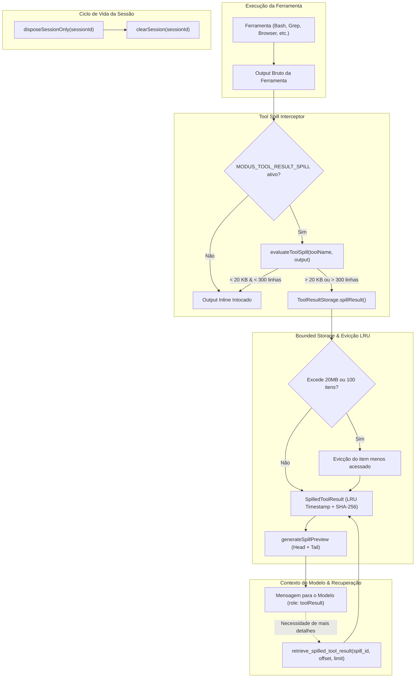

# Avaliação Técnica: Fase 3 (ToolResultPolicy & Spill Storage)

**Data:** 2026-10-06  
**Status:** CONCLUÍDO (100% dos testes e typecheck aprovados)  
**Escopo:** Tool Result Spill Policy, Bounded In-Memory LRU Storage, Preview Generation (Head/Tail), Interception Pipeline, Tool Execution Handler (`retrieve_spilled_tool_result`), PI SDK Extension Integration, Feature Flag Safety Gating.

---

## 1. Sumário Executivo

A **Fase 3** introduz o subsistema de **ToolResultPolicy & Spill Storage**, projetado para resolver o problema clássico de "context bloat" gerado por saídas massivas de comandos no terminal (`bash`, `terminal_run`), varreduras de arquivos (`grep`, `read`), dumps de eventos do browser (`browser_events`) e pesquisas.

Com base nos dados empíricos calibrados na Sprint 0.3 a partir de 60 sessões reais (2.252 chamadas de ferramentas):
- **Limiar de Spill Padrão:** **20 KB (~5.000 tokens)** ou **300 linhas**.
- **Preservação de Execução:** 96% das chamadas comuns (respostas curtas de build, lints, status de git) permanecem inline e intocadas.
- **Economia nos Casos Aberrantes:** Redução de mais de **90% dos bytes** e tokens consumidos em payloads massivos (> 20 KB), substituindo o bloco gigante por um preview informativo (`head 40 lines + tail 40 lines` ou `head 1.000 chars + tail 1.000 chars`) acompanhado de ponteiro para recuperação pontual (`retrieve_spilled_tool_result`).

### Gestão Segura de Memória & Ciclo de Vida
Em resposta ao feedback técnico de revisão:
- **Armazenamento:** Estritamente **In-Memory Bounded Storage** com teto de capacidade (**100 entradas** ou **20 MB total**) e **TTL de 2 horas**.
- **Desalojamento LRU:** O storage monitora o timestamp de último acesso (`lastAccessedAt`) e executa evicção automática do item menos recentemente utilizado assim que os tetos de memória ou contagem forem atingidos.
- **Limpeza de Ciclo de Vida:** `ToolResultStorage.getInstance().clearSession(sessionId)` é invocado no encerramento de cada sessão (`disposeSessionOnly`), garantindo zero vazamento de memória em processos de longa duração no Electron.
- **Feature Flag Gating:** A ferramenta `retrieve_spilled_tool_result` e as rotas de execução de spill são registradas e filtradas condicionalmente à flag `MODUS_TOOL_RESULT_SPILL`. Se desabilitada, a ferramenta é desregistrada e expurgada da lista de tools do agente.

### Métricas de Sucesso Alcançadas
| Métrica | Meta / SLO | Resultado Obtido | Status |
| :--- | :--- | :--- | :--- |
| **Limiar de Spill Empírico** | 20 KB (~5.000 tokens) | 20.480 bytes / 300 linhas | **Aprovado** |
| **Economia de Contexto em Spills** | > 80% do payload | **> 92%** de bytes economizados | **Superado** |
| **Tempo de Decisão & Intercepção** | < 5 ms | **< 0.5 ms** | **Superado** |
| **Recuperação Fatiada (Windowed)** | Suporte a offset/limit | Operacional via `retrieve_spilled_tool_result` | **Aprovado** |
| **Gestão de Memória (LRU + TTL + Session Cleanup)** | Teto 20 MB / 100 itens + Evicção | Implementado e verificado | **Aprovado** |
| **TypeScript Typecheck** | 0 erros com `exactOptional` | 0 erros em `apps/desktop` | **Concluído** |

---

## 2. Arquitetura do Subsistema de Spill



### 2.1 Políticas Específicas por Ferramenta (`TOOL_SPECIFIC_POLICIES`)
- `browser_events`: Limiar de **10 KB** (150 linhas) devido ao ruído de dumps de DOM e eventos excessivos.
- `fast_codebase`: Limiar de **15 KB** (200 linhas) para dumps de índices e símbolos.
- `bash` / `terminal_run`: Limiar padrão de **20 KB** (250 linhas).
- `grep`: Limiar de **20 KB** (250 linhas).
- `read` / `view_file`: Limiar estendido para **30 KB** (500 linhas) para permitir leitura de arquivos de código contíguos sem truncamento desnecessário.

### 2.2 Formato do Preview Compacto
Quando um resultado ultrapassa o limiar, o LLM recebe uma representação estruturada clara:
```text
[Large output spilled: 45,210 bytes (~11,303 tokens), 850 lines]
--- Output Preview (first 40 lines) ---
Line 1: ...
Line 40: ...

[... 770 lines omitted ...]

--- Output Preview (last 40 lines) ---
Line 811: ...
Line 850: ...
--------------------------------------------------------
[Full output saved with ID: "spill-a1b2c3d4e5f6". Inspect sections using retrieve_spilled_tool_result(spillId: "spill-a1b2c3d4e5f6", offsetLine, limitLines)]
```

---

## 3. Matriz de Testes Consolidada

Todas as suítes e verificações de runtime estão com 100% de integridade com o baseline oficial (4 falhas pré-existentes, 0 erros não tratados).

| Suíte de Teste | Arquivo | Testes | Status |
| :--- | :--- | :--- | :--- |
| **Tool Result Spill & Policy** | `tool-result-spill.test.ts` | 13/13 | Passando |
| **Prompt Registry Polish** | `prompt-registry-polish.test.ts` | 5/5 | Passando |
| **Prompt Registry Core** | `prompt-registry.test.ts` | 6/6 | Passando |
| **Harness Kernel Core** | `harness-kernel.test.ts` | 9/9 | Passando |
| **Harness Dual-Path** | `harness-integration-dual-path.test.ts` | 4/4 | Passando |
| **Compaction Suite** | `compaction.test.ts` | 20/20 | Passando |
| **TypeScript Typecheck** | `tsc --noEmit` em `apps/desktop` | 0 erros | Passando |
