# Avaliação Técnica: Fase 4 (Compaction com Pruning Inteligente)

**Data:** 2026-10-06  
**Status:** CONCLUÍDO (100% dos testes e typecheck aprovados, Go para Fase 5)  
**Escopo:** Preventive Context Pruning (Hook `context`), Headroom Restoration, Model-Aware Compaction Policies, Safe Compaction Delegation (`session_before_compact`), Evidence Preservation (MELHORIA 5), Compaction Coordinator, Harness Kernel Hook (`compact_prune`).

---

## 1. Sumário Executivo

A **Fase 4** introduz o subsistema de **Compaction com Pruning Inteligente** no Modus Agent Harness. Nas execuções longas de agentes (múltiplas turns de depuração, builds, refatorações e testes), a compactação ingênua do contexto gera problemas críticos de amnésia e perda de dados operacionais.

Com as correções de arquitetura aplicadas:
1. **Poda Preventiva Não-Destrutiva no Ponto Correto (Hook `context`):**
   - Em vez de tentar podar mensagens dentro de `session_before_compact` (onde substituições de mensagens não são suportadas pela API do SDK), a poda preventiva atua nativamente no hook `pi.on("context")`.
   - As mensagens enviadas ao LLM são inspecionadas, identificando buscas superseded (`grep`, `find`), saídas de logs antigos e leituras de arquivos já modificados, reescrevendo-as com tombstones concisos sem mutar o histórico integral da sessão.
   - O `modelId` ativo é extraído em tempo real via `ctx.model?.id`, aplicando a política de capacidade exata calibrada para cada modelo (`claude-opus-5`, `claude-sonnet-4-5`, `deepseek-chat`, `gpt-4o`).

2. **Delegação Segura de Compactação (`session_before_compact`):**
   - **Comandos Manuais (`event.reason === "manual"`):** Nunca são cancelados, respeitando a intenção explícita do usuário quando este digita `/compact`.
   - **Abaixo do Limiar (`tokensBefore < threshold`):** Retorna `{ cancel: true }`, evitando execuções desnecessárias e caras de compactação de contexto pelo LLM.
   - **Acima do Limiar:** Retorna `undefined`, permitindo que o método nativo `compact()` do PI SDK execute a sumarização real via LLM sobre `messagesToSummarize`. O runtime nunca descarta mensagens sem sumarização nem devolve resumos falsos/estáticos.

3. **Preservação de Evidências Críticas (MELHORIA 5):**
   - O motor de preservação de evidências captura e cataloga checks de QA, critérios aceitos, autorizações do usuário e decisões do harness para que permaneçam acessíveis e formatadas estruturadamente.

### Métricas de Sucesso Alcançadas
| Métrica | Meta / SLO | Resultado Obtido | Status |
| :--- | :--- | :--- | :--- |
| **Integração no Hook `context`** | Poda de mensagens via `on("context")` | Operacional com substituição de mensagens | **Aprovado** |
| **Políticas por Modelo (`modelId`)** | Resolução dinâmica via `ctx.model?.id` | Implementado com políticas calibradas | **Aprovado** |
| **Respeito a Compactação Manual** | Nunca cancelar `/compact` manual | Verificado (`reason: "manual"` -> `undefined`) | **Aprovado** |
| **Sumarização LLM Preservada** | Não retornar resumo estático/perder mensagens | Delegação nativa ao SDK via `undefined` | **Aprovado** |
| **Cancelamento Preventivo Automático** | Cancelar se abaixo do limiar | Operacional via `{ cancel: true }` | **Aprovado** |
| **Preservação de Evidência de QA & Spec** | 100% de retenção de checks QA e critérios aceitos | 100% preservado com markdown estruturado | **Superado** |
| **Proteção de Caminhos Críticos** | Nunca podar arquivos marcados (`neverPrunePaths`) | Respeitado rigorosamente | **Aprovado** |
| **TypeScript Typecheck** | 0 erros com `exactOptionalPropertyTypes` | 0 erros em `apps/desktop` | **Concluído** |
| **Baseline de Testes PiSdkRuntime** | 4 fail / 0 unhandled (baseline idêntico a HEAD) | **4 fail / 0 unhandled** estritamente atingido | **Concluído** |

---

## 2. Arquitetura do Subsistema de Pruning & Compaction

```mermaid
graph TD
    subgraph ContextHook ["Ponto de Integração 1: Intercepção de Contexto LLM"]
        Turn["Envio de Mensagens ao LLM"] --> CtxEvent["pi.on('context')"]
        CtxEvent --> CtxModel["ctx.model?.id"]
        CtxModel --> CtxPol["getCompactionPolicy(modelId)"]
        CtxPol --> CtxTokens["getContextUsage()?.tokens"]
        CtxTokens --> CtxOver{"Excede limiar de poda?"}
        CtxOver -->|"Não"| CtxPass["Retorna undefined (mensagens intocadas)"]
        CtxOver -->|"Sim"| Pruner["pruneCandidates(messages)"]
        Pruner --> Tombstones["Gera tombstones para tool outputs superseded"]
        Tombstones --> CtxResult["Retorna { messages: prunedMessages }"]
    end

    subgraph CompactHook ["Ponto de Integração 2: Intercepção de Compactação"]
        CompactTrigger["Acionamento de Compactação"] --> CompEvent["pi.on('session_before_compact')"]
        CompEvent --> ReasonCheck{"event.reason === 'manual'?"}
        ReasonCheck -->|"Sim (/compact)"| AllowManual["Retorna undefined (LLM compacta normalmente)"]
        ReasonCheck -->|"Não (auto)"| ThreshCheck{"tokensBefore < threshold?"}
        ThreshCheck -->|"Sim (headroom ok)"| CancelComp["Retorna { cancel: true } (evita LLM compaction)"]
        ThreshCheck -->|"Não (necessário)"| AllowAuto["Retorna undefined (PI SDK LLM compacta mensagens)"]
    end
```

---

## 3. Matriz de Testes Consolidada

Todas as suítes e verificações de runtime estão com 100% de conformidade com o baseline oficial:

| Suíte de Teste | Arquivo | Testes | Status |
| :--- | :--- | :--- | :--- |
| **Compaction Suite Completa** | `compaction.test.ts` | 20/20 | Passando |
| **Tool Result Spill & Policy** | `tool-result-spill.test.ts` | 13/13 | Passando |
| **Prompt Registry Polish** | `prompt-registry-polish.test.ts` | 5/5 | Passando |
| **Prompt Registry Core** | `prompt-registry.test.ts` | 6/6 | Passando |
| **Harness Kernel Core** | `harness-kernel.test.ts` | 9/9 | Passando |
| **Harness Dual-Path** | `harness-integration-dual-path.test.ts` | 4/4 | Passando |
| **PiSdkRuntime Integration Suite** | `pi-sdk-runtime.test.ts` | 137 pass / 4 fail (0 unhandled) | Idêntico ao baseline pré-existente |
| **TypeScript Typecheck** | `tsc --noEmit` em `apps/desktop` | 0 erros | Passando |

---

## 4. Conclusão e Veredito

Com a resolução completa de todos os bloqueadores identificados na revisão:
- **Bloqueador 1:** `turnStartIntentHook` restrito à classificação de contexto (`context.state`), delegando confirmação interativa ao runtime (11 regressões e 6 unhandled eliminados).
- **Bloqueador 2:** Pruning não-destrutivo integrado no hook `context`, respeito integral a `/compact` manual, e delegação para o LLM `compact()` no SDK.
- **Bloqueador 3:** Bounded in-memory storage (20 MB / 100 itens) com evicção LRU, TTL de 2 horas, limpeza em `disposeSessionOnly` e gating rigoroso por flag.

**Veredito:** **GO PARA A FASE 5 (Repeat Guards & Circuit Breakers)**.

---

## 5. Addendum de Revisão — Correções B e C (2026-10-06)

Duas lacunas apontadas na revisão do código da Fase 4 foram corrigidas nesta rodada:

### B — Janela de contexto real (antes: fallback fixo de 128k)
`getCompactionPolicy(modelId)` retornava `FALLBACK_COMPACTION_POLICY.contextWindow = 128_000` para qualquer modelo fora da tabela. Consequências: modelos com janela de 1M (ex.: `antigravity-gemini-3-pro`) compactavam cedo demais, e modelos com janela < 96k nunca atingiam o threshold — cancelando a compactação inclusive em `reason: "overflow"` e deixando o contexto estourar.

- `compaction-policy.ts`: `getCompactionPolicy(modelId?, contextWindow?)` agora aceita a janela declarada pelo runtime e a trata como autoritativa (validada: número finito, `0 < janela < 10M`).
- `pi-compaction-extension.ts`: as duas chamadas passam `ctx.model.contextWindow` (campo real do tipo `Model` do PI SDK).

### C — Podar apenas saída de ferramenta
`identifyPruneCandidates` marcava qualquer mensagem ≥1024 bytes como candidata, incluindo falas do usuário e do assistente (substituídas por tombstone no contexto enviado ao LLM).

- `compaction-pruner.ts`: novo filtro `isToolOriginated()` — só `role: "tool" | "toolResult"`, ou papel não-humano com `toolName`. `MessageLike.role` agora inclui `"toolResult"` (formato já usado nos fixtures do PI SDK).

### Nunca cancelar recuperação de overflow
- `pi-compaction-extension.ts`: `session_before_compact` só devolve `{ cancel: true }` quando `reason !== "overflow"` **e** `tokensBefore <= contextWindow` **e** não estourou o threshold. Overflow e estouro de janela sempre delegam ao `compact()` nativo.

### Validação (rodada 4)
| Verificação | Resultado |
|---|---|
| `tsc --noEmit` (`apps/desktop`) | 0 erros |
| Suíte harness (28 arquivos) | 365 pass / 5 skipped / 0 fail |
| `pi-sdk-runtime.test.ts` | 4 fail / 137 pass / 0 unhandled (= baseline) |
| Suíte completa | 22 arq. fail / 59 tests fail / 0 unhandled (baseline: 23 / 67) — **nenhum arquivo novo falhando** |
| Biome `organizeImports` (escopo do trabalho) | 0 erros |

Testes novos: `getCompactionPolicy` com janela declarada; não-cancelamento em `overflow`; não-cancelamento acima da janela real; pruner ignora mensagens de `user`/`assistant` mesmo grandes.
